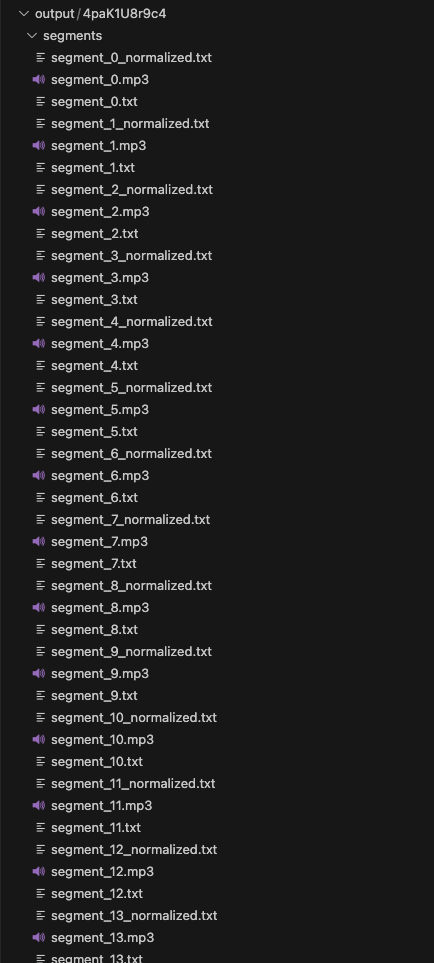

# TTS Dataset Creator for Any Language

This tool facilitates the creation of datasets similar to LibriTTS for any desired language.

In this repository, I have demonstrated dataset creation for the Irish language.

## Steps Taken to Create the Dataset

- **Audio Creation**:
  - Utilizing the YouTube API V3 to crawl through specific videos on YouTube.
  
- **Transcript Fetching**:
  - Utilizing the `youtube_transcript_api` to retrieve the transcript.
  
- **Matching Text and Audio**:
    - Upon obtaining the transcript, the transcript is  retrived in the preferred language.
    - Since this is for the Irish Language (`Gaeilge`), the keyword `ga` is used to confirm the language.
    - Once the correct transcript is obtained, the audio is segmented to align with the transcript and generate audio and text files with corresponding segment names.
    
- **Normalization of Text**:
    - Following the segmentation and alignment of the transcript, the text is normalized using the following rules:
        - Removal of speaker identifiers (e.g., Speaker 1:, Participant 2:, etc.)
        - Elimination of timestamps (e.g., [00:00:00], [01:23:45], etc.)
        - Exclusion of non-verbal sounds (e.g., [Applause], [Laughter], [Music], etc.)
        - Omission of text within round brackets
        - Exclusion of text within flower brackets
        - Removal of text within braces
        - Elimination of extra spaces


# Installation

Download this repository and install the packages in requirements.txt

I have used Python 3.11.5

```bash
pip install -r requirements.txt
```

# Run the main file 

- Create an account in youtube V3 and get the API key.
- Update the API key in `main.py` file
```bash 
api_key = "API_KEY"
```

- run the `main.py` to create the datasets
```bash
python3 main.py
`````` 


The Output files would be saved in the output folder with this structure
- output
    - video_ID
        - segments
            - segment_0.mp3
            - segment_0.txt
            - segment_0_normalized.txt
            - .
            - .
            - .
        - audio.mp4
    - video_ID
    - video_ID



